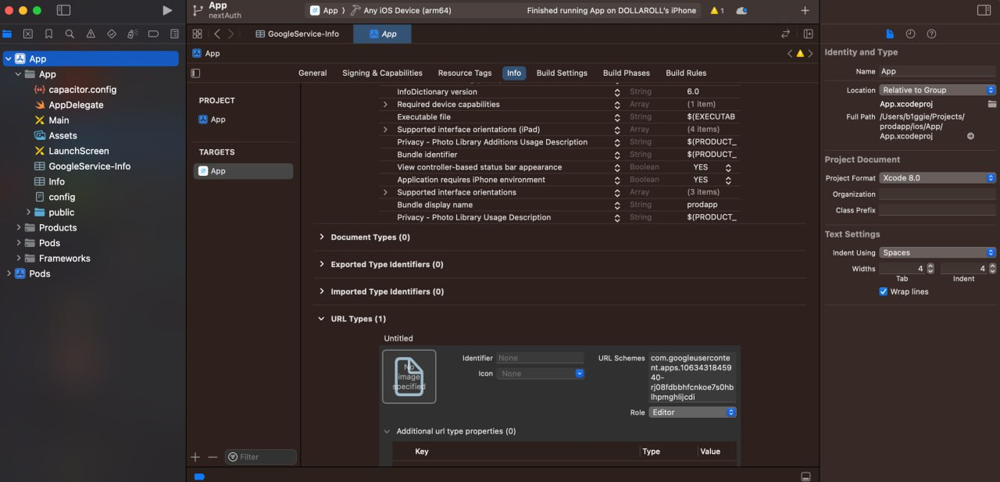

# 📄Тестовое задание

## 📝 Используемые технологии: NextJs(typescript) + Ionic + Capacitor, PrismaORM, S3

## 📗 Основные требования:

### ✅ 1. Создание карточки товара:

-   [x] 1.1 Пользователь должен иметь возможность вводить данные товара: название, описание, цену и изображение.
-   [x] 1.2 Данные должны сохраняться в локальном хранилище приложения.

### ✅ 2. Генерация QR-кода:

-   [x] Для каждой созданной карточки товара приложение должно генерировать уникальный QR-код.
-   [x] QR-код должен кодировать идентификатор товара или другую уникальную информацию, позволяющую идентифицировать товар.

### ✅ 3. Сканирование QR-кода и отображение информации о товаре:

-   [x] При сканировании QR-кода приложение должно распознавать и отображать соответствующую карточку товара.
-   [x] Должен быть реализован интерфейс для сканирования QR-кода.

### ✅ 4. Интерфейс пользователя:

-   [x] Интерфейс должен быть интуитивно понятным и удобным для пользователя.
-   [x] Дизайн интерфейса может быть простым, но аккуратным.

## 📕 Дополнительные задачи (по желанию):

### ✅ 1. Добавление функции редактирования и удаления карточек товаров.

### ✅ 2. Использование внешнего API для хранения данных о товарах.

### ✅ 3. Добавление пользовательской аутентификации.

---

## 📋 Запуск Web версии проекта

1. `git clone git@github.com:RolanAbbasguliev/prodapp.git`
2. `cd prodapp/client`
3. `npm i`
4. `docker compose up` - Инициализация базы данных
5. `npm run start`
   Проект откроется на 3000 порту

## 🎬 WEB Implementation

## 📋 Запуск Мобильной версии проекта

1. `git clone git@github.com:RolanAbbasguliev/prodapp.git`
2. `cd prodapp`
3. `docker compose up` - Инициализация базы данных
4. `npm i`

5. ❗️В файле capacitor.config.ts нужно заменить ip в url на свой локальный ip

6. `npx cap add ios` // **ios** -> android
7. `npx run build`
8. `npm run build:phone:ios`
9. `npx cap sync`
10. `npm run start`
    Сервер будет крутиться на 3000 порту
11. `npx cap open ios`

## Google Auth

1. Скопировать файл в репозитории /GoogleService-info.plist в /ios/App/App/ (он должен лежать рядом с Info.plist)
2. В Xcode открыть файл и скопировать значение из поля REVERSEDD_CLIENT_ID
3. Добавить значение в URL Types в поле URL Schemese как показано на риснке (Раздел Info) 
